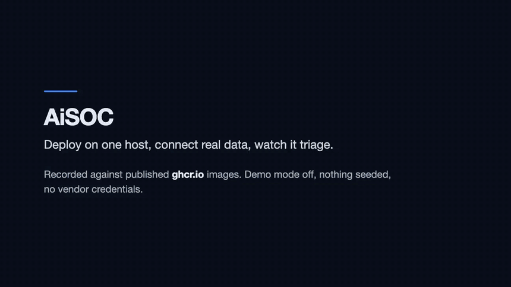
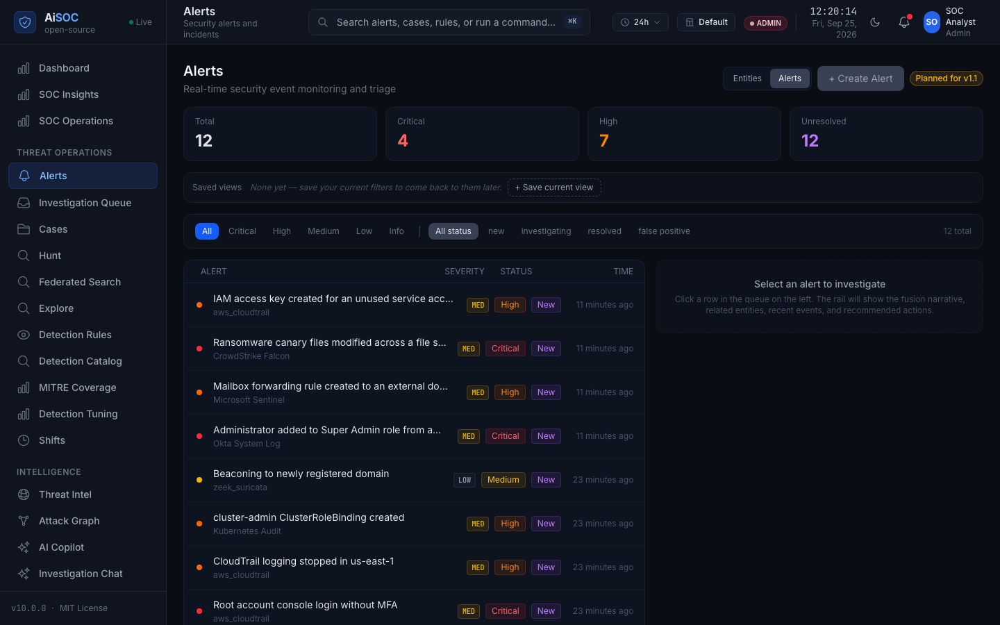
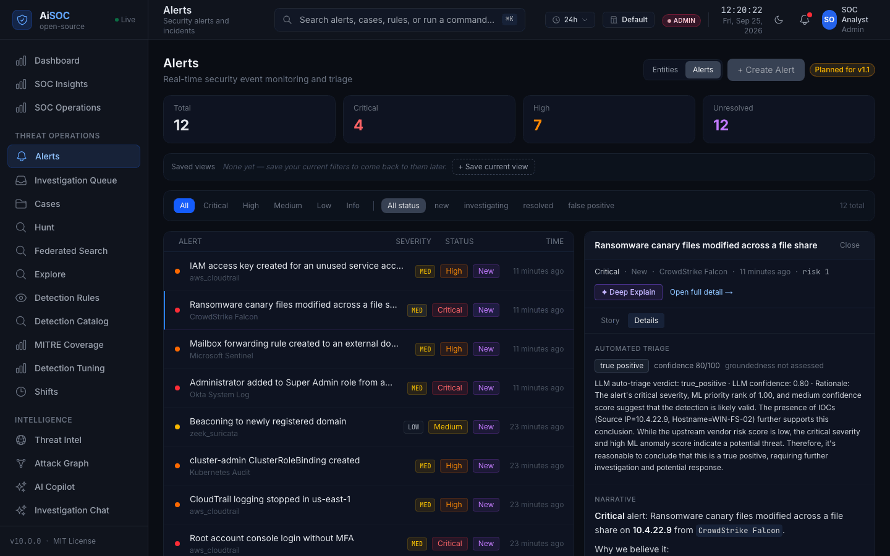
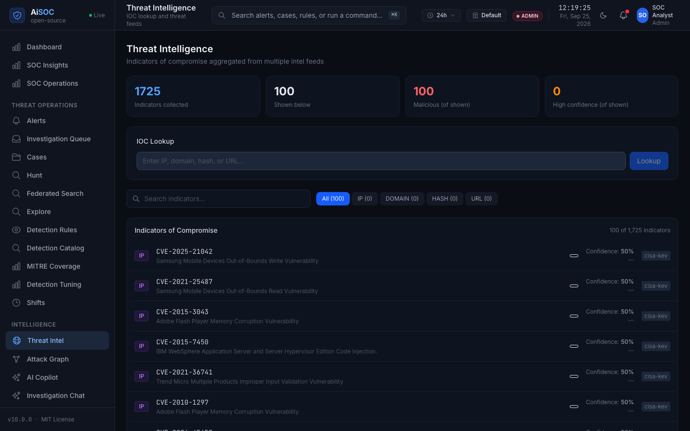
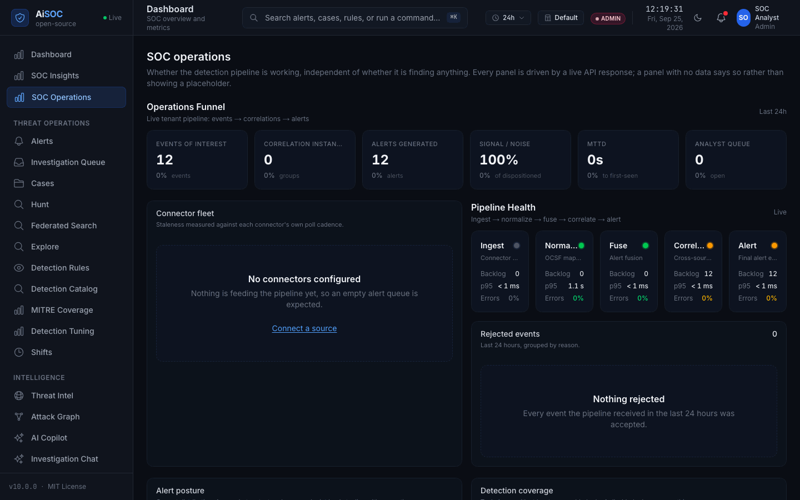

<div align="center">


# AiSOC

**An open-source, self-hostable AI Security Operations Center.** It ingests your security telemetry, detects and correlates threats, investigates them with AI agents whose reasoning is fully auditable, and proposes responses a human approves.

[](https://opensource.org/licenses/MIT)
[](CHANGELOG.md)
[](https://github.com/beenuar/AiSOC/actions/workflows/ci.yml)
[](https://github.com/beenuar/AiSOC/actions/workflows/codeql.yml)
[](https://securityscorecards.dev/viewer/?uri=github.com/beenuar/AiSOC)

[Docs](https://beenuar.github.io/AiSOC/) · [Architecture](docs/architecture/README.md) · [What actually works](docs/audit/REPOSITORY_REALITY.md) · [Discussions](https://github.com/beenuar/AiSOC/discussions)

</div>

---

## What AiSOC does

Telemetry arrives from your security tools. AiSOC normalizes it, runs 833
executable detection rules over it, groups what fires into incidents,
investigates each one with an AI agent whose every prompt and tool call is
recorded, and proposes an action. A human approves before anything executes.

## What it looks like running

<a href="https://beenuar.github.io/AiSOC/docs/deployment/walkthrough"></a>

**[Watch the full three minutes](https://beenuar.github.io/AiSOC/docs/deployment/walkthrough)** —
install to AI verdict on one server, against the published images. Terminal waits
are shortened, which the recording says on screen. It is also committed here, at `apps/web/public/demo/demo.mp4`.

Stills from earlier runs under the same rules — no seeded rows, no demo mode, no
mockups. The events were authored to be representative; everything downstream of
them is the product doing its job. ([what is real](apps/web/public/screenshots/README.md))

| | |
|---|---|
|  |  |
| **Alerts** — each attributed to the connector that fed it. | **Automated triage** — the bundled local model's verdict, confidence and rationale, verbatim. |
|  |  |
| **Threat intelligence** — 1,725 real CISA KEV entries, minutes after boot, with no API key. | **SOC operations** — with nothing connected yet, and it says so rather than showing a placeholder. |

## Quick start

```bash
git clone https://github.com/beenuar/AiSOC && cd AiSOC
make up
```

Needs Docker Compose v2 with **8 GB memory and 20 GB free disk in the Docker
VM**, plus `python3` (3.9+) and `bash` — `make doctor` checks all of it, and
[Installation](https://beenuar.github.io/AiSOC/docs/installation#requirements)
says what each number was measured against. The first run downloads a ~2 GB
language model into a named volume; only `make clean` fetches it again.

`make up` also creates `.env` and generates the three secrets in it — the
credential-vault key, the session signing key, and the service-to-service
token — then creates an administrator and prints its password. That password is
generated on your machine, shown once, and stored nowhere: copy it, or mint a
new one with `make bootstrap ARGS=--reset-password`.

Then **prove it actually works**. `make smoke` posts one real event to the
ingest API, follows it through Kafka, detection, correlation and Postgres, and
reads the alert back out of the public API. Every stage reports PASS or FAIL:

```
$ make smoke
[PASS] raw telemetry accepted by ingest
[PASS] event traversed the spine and became an alert
[PASS] alert is retrievable by id from the API
```

Open **http://localhost:3000** and sign in with the credentials `make up`
printed (API docs at **http://localhost:8000/api/docs**). On a server, set
`AISOC_CONSOLE_URL` in `.env` — `make up` then prints that address rather than
localhost, which is the one people can actually browse to. Stuck? `make doctor`.

## Try it without connecting anything

`make demo` loads a dataset. **It is synthetic**: it shows the pipeline shape,
not real activity. Every row is marked `is_synthetic = true` in the database
and labelled in the console. It is not a benchmark, a customer, or an incident.

## Connect real data

Two ways in. Push, with a credential from `make ingest-token` (the tenant comes from it, not from a header):

```bash
curl -X POST http://localhost:8081/v1/ingest/batch \
  -H 'Content-Type: application/json' -H "Authorization: Bearer $AISOC_INGEST_TOKEN" \
  -d '{"connector_id":"edr-1","connector_type":"crowdstrike","source_format":"json",
       "events":[{"severity":"high","title":"Encoded PowerShell from Office",
                  "host":"WIN-FIN-01","process_name":"powershell.exe"}]}'
```

Or pull, by configuring one of **84 click-and-connect data connectors** in
**Settings → Connectors** (needs the `full` profile). Those with
vendor-specific normalization and live setup docs include Splunk, Microsoft
Sentinel, Elastic, CrowdStrike, Okta, AWS (GuardDuty / CloudTrail / Security
Hub), Wiz, and Kubernetes audit logs — full list in the
[connector docs](https://beenuar.github.io/AiSOC/docs/connectors/api-coverage).
Without a vendor profile a connector still ingests through a generic mapping
that resolves host, user and source IP from the usual spellings.

## How it works

Ingest normalizes to a common shape and Kafka carries it. Then fusion runs 833
executable detection rules and decides what becomes an alert, correlation groups
related alerts into one incident, an agent investigates and writes its reasoning
to the Investigation Ledger, and a human approves any response.

Both **[docs/architecture/README.md](docs/architecture/README.md)** and the
[docs portal](https://beenuar.github.io/AiSOC/docs/architecture) walk that path
one step at a time, and every box in every diagram links to the code that
implements it.

## Deployment profiles

| Profile | Command | Services | RAM | What you get |
|---|---|---|---|---|
| **core** | `make up` | 14 | ~8 GB | The full alerting pipeline: ingest → detect → correlate → alert → triage → console, plus the LLM gateway, a local model, and the CISA KEV threat feed |
| **full** | `make up-full` | 22 | ~12 GB | Core plus event lake, entity graph, full-text search, enrichment, scheduled connectors |
| **demo** | `make up && make demo` | 14 | ~8 GB | Core plus labelled synthetic data |

CORE is the smallest deployment that takes a real event and produces a real
alert, and **it needs no credentials to do either** — for two reasons.

**The model ships with the gateway.** Ollama runs a pinned ~2 GB
`llama3.2:3b-instruct-q4_K_M` sized for CPU-only inference, so `make up`
produces real triage verdicts with real token counts in the Investigation
Ledger — not a stub. It is also not a frontier model, and the difference shows:
in a measured run of 19 auto-triages it returned schema-valid output 7 times,
and the other 12 fell back to the deterministic path, which the rail labels.
To upgrade, set `OPENAI_API_KEY`, `AISOC_LLM_MODEL_FAST`, `AISOC_LLM_MODEL_DEEP`
and an empty `AISOC_LLM_API_BASE`. **No hosted provider has ever been exercised
here** — there is no funded key, so per-model rows read *not measured* rather
than zero. ([ADR-0006](docs/decisions/0006-llm-gateway-in-core.md))

**One real external feed ships too.** `services/threatintel` polls the
[CISA Known Exploited Vulnerabilities](https://www.cisa.gov/known-exploited-vulnerabilities-catalog)
catalog — authoritative, public, no API key — into the console's Threat
Intelligence page: the one thing in a fresh install that is neither synthetic
nor yours.

## Real vs synthetic data

This matters more than any feature, so it is stated plainly.

| Kind | Where | How you can tell |
|---|---|---|
| **Real** | Your connectors and the ingest API | `is_synthetic = false` (the default) |
| **Real, and not yours** | The CISA KEV feed on the Threat Intelligence page | Every row carries `source: cisa-kev`; it is the public catalog, unmodified |
| **Demo** | `make demo` | `is_synthetic = true`, labelled in the console |
| **Benchmark** | `services/agents/tests/eval_data/` | Every published row carries `substrate: true` |
| **Test fixtures** | `tests/`, `**/tests/` | Never shipped in an image |

**Production never silently falls back to synthetic data.** When a backend is
unreachable the console names the failure, not an invented investigation — and
an unmeasured figure reads *not measured*, never `0`. That was not always true;
see [the reality audit](docs/audit/REPOSITORY_REALITY.md) for where it was
wrong and how each case was fixed.

## AI agents

Agents triage alerts and investigate incidents. What they can and cannot do:

- **They read** the alert, its correlated siblings, entity context, and prior
  verdicts for the same signature.
- **They call typed tools** — lake queries, graph traversals, enrichment
  lookups. The model chooses a tool and passes arguments; it never writes SQL.
- **Everything is logged** to the Investigation Ledger: prompts, tool calls,
  citations, the verdict, and token cost.
- **Grounding is checked.** A verdict citing an indicator the evidence never
  contained is demoted to human review rather than auto-closed.
- **A prompt is validated before it is sent.** Raw logs, OCSF payloads and
  secret-shaped values are refused, not redacted after the fact.
- **Nothing executes without a human.** An approver must hold the required
  permission tier and must not be the person who requested the action.

The bundled model means agents reason for real out of the box. When it returns
something the schema rejects, triage falls back to a deterministic path and the
rail shows which one answered — it never fabricates a verdict.

## Project maturity

| Capability | Status | Tested | Production ready |
|---|---|---|---|
| Ingest → detect → correlate → alert | Stable | E2E + unit | Yes |
| Detection engine (833 executable rules) | Stable | Fixture replay + unit | Yes |
| Alert correlation into incidents | Stable | Unit | Yes |
| REST API + web console | Stable | Unit + integration | Yes |
| AI triage + Investigation Ledger | Beta | Unit + substrate eval + local-model run | Yes, copilot mode |
| Event lake + hunting (ClickHouse) | Beta | Unit | Yes, `full` profile |
| Entity graph (Neo4j) | Beta | Unit | Yes, `full` profile |
| Governed response actions | Beta | Unit | Human-approved only |
| Scheduled connectors | Beta | Contract tests | `full` profile |
| UEBA | Beta | Unit + live migration round-trip | `full` profile |
| Package distribution (npm/PyPI) | Ready, unpublished | `release.yml` builds and packs all eight on every tag | Install from source — the upload is blocked on registry credentials, which is an account action |

## What AiSOC is not

- **Not a drop-in SIEM replacement.** It correlates and investigates; it does
  not replace long-term log retention and compliance search.
- **Not able to see telemetry you have not connected.** There is no discovery.
- **Not autonomous by default.** Response requires explicit policy
  authorization and a human approver.
- **Demo incidents are not real incidents**, and benchmark corpora are not
  customer telemetry.
- **Benchmark numbers are substrate self-consistency measures**, not live
  agent accuracy, and are labelled as such wherever published.

## Troubleshooting

`make doctor` checks the host tools, memory and disk in the Docker VM, every
port, each datastore by querying it rather than by asking whether its container
is up, and whether `.env` still holds placeholders — then prints the command to
run next. The six failures it is most often right about are tabulated under
[Installation → Troubleshooting](https://beenuar.github.io/AiSOC/docs/installation#the-six-most-common-failures).

## Security

Secrets are generated per deployment and never committed; connector credentials
are encrypted at rest. Services connect to Postgres as a DML-only role, so the
row-level-security policies actually apply to them, and tenant isolation is
enforced at the query layer in every store. RBAC gates every mutating route,
ingest is authenticated, and the default install sends no prompt anywhere —
the model runs beside it. Report issues via [SECURITY.md](SECURITY.md).

## Developing

```bash
make test        # unit tests for every service
make smoke       # the golden pipeline, against a running stack
make stats       # recount every figure this README publishes
```

Guides: [add a connector](https://beenuar.github.io/AiSOC/docs/plugins/hello-plugin) ·
[add a detection](https://beenuar.github.io/AiSOC/docs/detections/hello-hunt) ·
[plugin lifecycle](https://beenuar.github.io/AiSOC/docs/plugins/lifecycle) ·
[contributing](CONTRIBUTING.md). The connector and detection-rule counts above
are recounted from the tree by `scripts/project_stats.py`, which CI fails if
this README disagrees with it.

## Roadmap · Contributing · License

[ROADMAP.md](ROADMAP.md) · [CONTRIBUTING.md](CONTRIBUTING.md) · [SECURITY.md](SECURITY.md) · MIT
