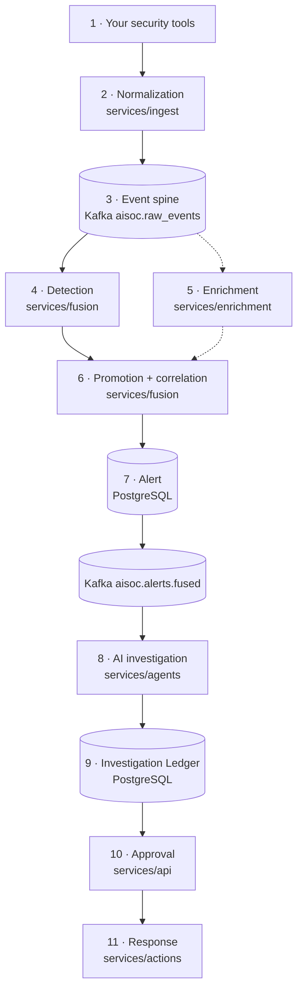
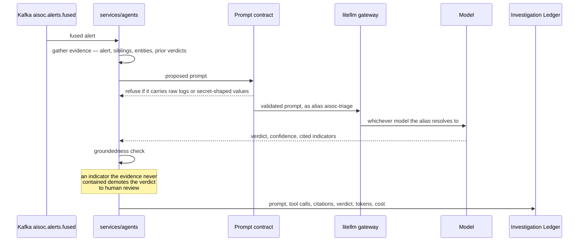

# Architecture

This page follows **one security event** from the moment something hands it to
AiSOC until a human approves a response. That ordering is deliberate: a list of
services tells you what exists, and this tells you what happens.

Every box in every diagram below corresponds to code in this repository and
links to it. Where a component exists but nothing calls it on this path, it
says so rather than being quietly drawn in.

## The path, in one diagram



The dashed branch is the `full` profile. Everything solid runs in CORE, which
is what `make up` starts.

---

## 1 · Something hands AiSOC an event

Two doors, and they are genuinely different.

**Push.** Anything that can make an HTTP request posts to the ingest API, with
a token minted by `make ingest-token`:

```bash
curl -X POST http://localhost:8081/v1/ingest/batch \
  -H 'Content-Type: application/json' -H 'Authorization: Bearer <push-token>' \
  -d '{"connector_id":"edr-1","connector_type":"crowdstrike","source_format":"json",
       "events":[{"severity":"high","title":"Encoded PowerShell from Office",
                  "host":"WIN-FIN-01","process_name":"powershell.exe",
                  "parent_process":"winword.exe"}]}'
```

**Pull.** [`services/connectors`](https://github.com/beenuar/AiSOC/tree/main/services/connectors)
polls a vendor API on a schedule, decrypts that tenant's stored credentials
through the vault at poll time, and forwards the result to the same ingest
endpoint. It is a `full`-profile service; CORE accepts pushes instead. The
registry is **now 84 connectors** — that figure is generated from
`services/connectors/app/connectors/__init__.py` by
[`scripts/generate_connector_count.py`](https://github.com/beenuar/AiSOC/blob/main/scripts/generate_connector_count.py),
which fails CI if this sentence disagrees with the tree.

:::info The tenant comes from the credential, never from the header
Every ingest door is authenticated, and each resolves a tenant from the
credential rather than believing a header:

| Door | Credential |
|---|---|
| `/v1/ingest`, `/v1/ingest/batch` | A minted push token pinned to the `connector-push` template, **or** `AISOC_SERVICE_TOKEN` for AiSOC's own services, which poll for many tenants and declare one on `X-Tenant-ID` |
| `/v1/inbox/{token}`, `/v1/inbox/email/{token}` | A minted per-tenant inbox token in the path |
| `/v1/inbox/cef`, `/v1/inbox/hec` | The same, in a header, pinned to their own templates |
| `/v1/ingest/k8s-audit/{tenant}` | The `X-AiSOC-K8s-Token` shared secret; 503 until one is set |

The pinning matters: an inbox token is pasted into a third party's webhook
configuration, so minting one for a paging vendor must not also hand that
vendor a general ingest credential.

`X-Tenant-ID` is still read and is never authority — it is **intersected** with
what the credential authorises, so naming a tenant outside that scope narrows
to nothing and is refused rather than reaching out. There is no dev-mode
bypass, and an ingest service that cannot verify a credential answers 503
rather than accepting the write. Procedure:
[Ingest authentication](./operations/ingest-authentication).
:::

## 2 · Ingest normalizes it

[`services/ingest`](https://github.com/beenuar/AiSOC/tree/main/services/ingest)
(Go, container port 8080) maps the vendor payload onto a common OCSF-shaped
envelope using a per-connector **profile**, in
[`internal/normalizer`](https://github.com/beenuar/AiSOC/tree/main/services/ingest/internal/normalizer).

A profile decides two things that matter downstream: the OCSF `class_uid` — a
vendor finding that already passed the vendor's own correlation belongs at
`2001`, Security Finding — and the vendor's severity ladder, mapped onto the
five tiers `info | low | medium | high | critical`.

A connector with no profile falls through to a **vendor-neutral generic
profile**, which resolves `actor.user.name`, `device.name` and
`src_endpoint.ip` from the spellings connectors actually use (`user` /
`username` / `actor`, `host` / `hostname`, `src_ip` / `source_ip` /
`client_ip`) in a fixed order. The event keeps the entities the rest of the
platform pivots on; what a vendor profile adds is that vendor's own field names
and its OCSF class.

[`scripts/check_connector_profiles.py`](https://github.com/beenuar/AiSOC/blob/main/scripts/check_connector_profiles.py)
fails CI if a connector identifier stops resolving in either direction.

## 3 · It enters the event spine

Ingest publishes to the Kafka topic **`aisoc.raw_events`**. This is the
boundary that makes everything downstream independent: a consumer can be added,
restarted or left to fall behind without ingest knowing about it.

Kafka is not a cache here. It is the reason a slow detection worker cannot
block the front door, and the reason an event is not lost when fusion restarts.

## 4 · Fusion evaluates detections

[`services/fusion`](https://github.com/beenuar/AiSOC/tree/main/services/fusion)
(container port 8003) consumes the spine and runs **2,603 executable detection
rules** against each event.

The rules the engine runs are compiled into
[`app/data/detection_ruleset.json`](https://github.com/beenuar/AiSOC/blob/main/services/fusion/app/data/detection_ruleset.json)
and its imported counterpart beside it. The YAML under `detections/` is a
*projection* of those, not the engine's input — 6,991 rules are on disk and
2,603 load, which is why the corpus figure and the executable figure are
published separately. See
[the detection truth table](https://github.com/beenuar/AiSOC/blob/main/docs/detections/truth-table.md).

Executable is a claim backed by a replay, not by a flag: a rule enters the
compiled ruleset only after a vendor-shaped event has been pushed through the
real connector and this engine and that rule was observed to fire, with an
empty event of the same shape producing nothing. The proof is checkable in
both directions —
`scripts/compile_sigma_ruleset.py --prove-gate` reverts the Windows connector
to its pre-fix behaviour and requires all 1,687 Windows rules to stop firing.
It does not claim the rules detect attacks, only that they are reachable.

| Step | Code |
|---|---|
| Match a rule against an event | [`detection_engine.py`](https://github.com/beenuar/AiSOC/blob/main/services/fusion/app/services/detection_engine.py) · [`detection_matcher.py`](https://github.com/beenuar/AiSOC/blob/main/services/fusion/app/services/detection_matcher.py) |
| Derive fields rules match on | [`derived_fields.py`](https://github.com/beenuar/AiSOC/blob/main/services/fusion/app/services/derived_fields.py) |
| Rules needing a time window | [`windowed_detection.py`](https://github.com/beenuar/AiSOC/blob/main/services/fusion/app/services/windowed_detection.py) |
| Events the consumer cannot parse | [`dlq.py`](https://github.com/beenuar/AiSOC/blob/main/services/fusion/app/services/dlq.py) → `aisoc.alerts.dlq` |

## 5 · Enrichment, if it is running

[`services/enrichment`](https://github.com/beenuar/AiSOC/tree/main/services/enrichment)
adds threat-intel and vulnerability context at fuse time. It is a
`full`-profile service. **In CORE it is absent and fusion skips it** — not
retried, not silently failed, skipped.

Separately and in CORE,
[`services/threatintel`](https://github.com/beenuar/AiSOC/tree/main/services/threatintel)
polls the CISA Known Exploited Vulnerabilities catalogue — public, keyless,
authoritative — into Qdrant, which is what the console's Threat Intelligence
page reads. It is the only externally-sourced real data a fresh install has:
1,725 entries were collected within a poll interval of `make up` on the stack
these captures came from.


Note what the counters say. **1,725** is the store's count; **100** is the page
being displayed; and the two cards beneath are explicitly *of shown*. A page
that reports its own length as the size of the corpus is a small lie that gets
believed, so the page does not.

## 6 · Promotion and correlation

Two separate decisions, often confused:

**Promotion** asks whether this event should become an alert at all.
[`promoter.py`](https://github.com/beenuar/AiSOC/blob/main/services/fusion/app/services/promoter.py)
promotes an OCSF category-2 finding or anything at `severity_id >= 4`. Routine
telemetry is not promoted; with the `full` profile it is still archived to the
event lake and remains huntable.

**Correlation** asks whether this alert belongs with others.
[`correlator.py`](https://github.com/beenuar/AiSOC/blob/main/services/fusion/app/services/correlator.py)
keys on `{tenant}:{entity}:{tactic}` in Redis, so ten related alerts become one
thing an analyst looks at rather than ten.

Fusion also writes, at fuse time and without an LLM:

- a deterministic **correlation narrative** ([`narrative.py`](https://github.com/beenuar/AiSOC/blob/main/services/fusion/app/services/narrative.py)) — reads never call a model;
- a **confidence** score, 0–100 with a `low | medium | high` band ([`confidence.py`](https://github.com/beenuar/AiSOC/blob/main/services/fusion/app/services/confidence.py)), which is independent of severity;
- **provenance** ([`provenance.py`](https://github.com/beenuar/AiSOC/blob/main/services/fusion/app/services/provenance.py)) so the alert can say which connector fed it.

The queue below is the output of exactly this path on a CORE stack — twelve
alerts, each attributed to the connector whose profile normalized it, produced
from telemetry pushed through the ingest API above.


## 7 · The alert is written, and announced

[`alert_sink.py`](https://github.com/beenuar/AiSOC/blob/main/services/fusion/app/services/alert_sink.py)
inserts the row into PostgreSQL and publishes to **`aisoc.alerts.fused`**.

Two consumers pick it up.
[`services/realtime`](https://github.com/beenuar/AiSOC/tree/main/services/realtime)
(Node, container port 4000) pushes it to the console over WebSocket.
[`services/agents`](https://github.com/beenuar/AiSOC/tree/main/services/agents)
takes it for triage — the next step.

## 8 · An agent triages it

`FusedAlertTriageWorker` in
[`services/agents`](https://github.com/beenuar/AiSOC/tree/main/services/agents)
(container port 8084) auto-triages **every** fused alert.



Four properties, each enforced in code rather than asserted:

- **The contract runs before the request.** A prompt about to carry raw OCSF, vendor log lines or secret-shaped values is refused, not redacted afterwards ([`prompt_sanitizer.py`](https://github.com/beenuar/AiSOC/blob/main/services/agents/app/investigator/prompt_sanitizer.py)).
- **The model never writes a query.** It picks a typed tool and passes arguments; the tool writes the SQL or the traversal.
- **Citations are checked.** A verdict citing an indicator that was not in the evidence is demoted rather than auto-closed. Groundedness is nullable, and `null` means *not assessed* — a different fact from zero.
- **Every alias resolves at the gateway.** AiSOC asks for `aisoc-triage`, not for a model name; [`infra/litellm/config.yaml`](https://github.com/beenuar/AiSOC/blob/main/infra/litellm/config.yaml) maps aliases to models, so swapping local for hosted is three variables in `.env`.

### What the default install actually does

CORE ships a pinned `llama3.2:3b-instruct-q4_K_M` behind the gateway, so a
clone with no account produces a real verdict with real token counts. It is a
3B quantized model, and the difference from a frontier model is visible: in a
measured run of 19 auto-triages on a CORE stack, **7 returned schema-valid
output and 12 did not**. The 12 fell back to the deterministic path, logged
`auto_triage_worker.llm_failed_fallback`, and the Investigation Rail shows
which path produced the verdict it is displaying.

**No hosted provider has ever been exercised in this repository.** There is no
funded key, so per-model figures read *not measured* rather than zero. The
local path is measured; the hosted path is configured and untested. Treat those
as the different claims they are.

Here is one of the 7, as the console renders it — the verdict, the confidence,
the groundedness (*not assessed*, because this run did not score it), and the
model's own rationale reproduced verbatim so a reader can tell which path
answered:


## 9 · The reasoning is written down

Every prompt, tool call, citation, verdict, token count and cost goes to the
**Investigation Ledger**, append-only and tenant-scoped. The verdict is also
projected back onto the alert row, which is what the Investigation Rail's
*Automated triage* section renders.

The point is not audit for its own sake: a verdict you cannot inspect is a
verdict you have to trust, and this project does not ask you to.

- Schema: [`008_investigation_ledger.sql`](https://github.com/beenuar/AiSOC/blob/main/services/api/migrations/008_investigation_ledger.sql)
- Writer: [`ledger.py`](https://github.com/beenuar/AiSOC/blob/main/services/agents/app/investigator/ledger.py)
- Reader: [`investigations.py`](https://github.com/beenuar/AiSOC/blob/main/services/api/app/api/v1/endpoints/investigations.py)

## 10 · A human approves

Nothing executes on its own. An action is **proposed**; a human with the right
permission approves it; and the approver may not be the person who requested
it.

Risk, reversibility, verification and approval tier are declared **per
capability** — the contract belongs to the verb, not to the vendor that
implements it. See [Live actions](./concepts/live-actions) and
[Action approvals](./operations/action-approvals).

## 11 · The action runs, and is verified

[`services/actions`](https://github.com/beenuar/AiSOC/tree/main/services/actions)
executes the approved capability against the vendor and then **probes the
vendor to confirm it took effect**, rather than inferring success from an HTTP
200. A capability whose effect cannot be verified is not eligible for automatic
execution.

Without vendor credentials an executor returns `simulated` and says so.
`executed` is the single field that means a vendor was actually touched.

Playbooks reach this same path. The engine's step vocabulary is 22 types
([`models.py`](https://github.com/beenuar/AiSOC/blob/main/services/agents/app/playbook/models.py)),
and the editor's palette offers **21** of them — `approval` is withheld because
the engine is a single-threaded index walk with no pause or resume, so a step
it cannot run is not offered as a button.

---

## Where the path stops

Step 10 has no automatic trigger. There is no code path that dispatches a
response without a human. That is deliberate, and it is the honest boundary of
the word "autonomous" in this project.

## What runs in which profile

| Profile | Command | Long-running services | Memory | What you get |
|---|---|---|---|---|
| **core** | `make up` | 14 | ~8 GB | Steps 1–10, plus the LLM gateway, the local model behind it, and the CISA KEV feed with its vector store |
| **full** | `make up-full` | 22 | ~12 GB | Core plus the event lake, entity graph, full-text search, enrichment and scheduled connectors |
| **demo** | `make up && make demo` | 14 | ~8 GB | Core plus clearly-labelled synthetic data |

CORE is 14 long-running containers; `ollama-pull` is a fifteenth that fetches
the model once and exits. `full` is 22 long-running containers — not 30, which
is every profile including `monitoring`, `chatops`, `extras` and `osquery`,
none of which `make up-full` starts.

Memory and disk are measured, not estimated: the model container reaches about
3 GiB while answering, which is what moved the floor to 8 GB, and CORE is about
16.5 GB of unique image layers plus a 2 GB model volume.

## Which store holds what, and what breaks without it

| Store | Profile | Holds | Without it |
|---|---|---|---|
| **PostgreSQL** | core | Alerts, incidents, cases, users, tenants, rules, audit log, ledger | Nothing works |
| **Redis** | core | Correlation windows, dedup keys, investigation run state | No correlation — every alert becomes its own incident |
| **Kafka** | core | `aisoc.raw_events`, `aisoc.alerts.fused`, `aisoc.alerts.dlq` | No spine; ingest would have to call every consumer directly |
| **Qdrant** | core | Threat-intel indicators and actor embeddings | No Threat Intelligence page, no semantic IOC matching |
| **ClickHouse** | full | Every normalized event | No event lake, no hunting over raw telemetry. **Alerting is unaffected** |
| **Neo4j** | full | Entity graph, blast radius | No graph context. The `/graph` page reports the failure rather than drawing an invented graph |
| **OpenSearch** | full | Full-text IOC and actor search | Threat-intel feeds still write to Qdrant; full-text IOC search is unavailable and says so |

## How tenant isolation is actually enforced

Per store, because one mechanism does not cover them all:

| Store | Mechanism |
|---|---|
| PostgreSQL | Row-level security **plus** a `tenant_id` predicate at the query layer |
| ClickHouse | `lake_sql.rewrite_for_tenant()` injects the predicate and **fails closed** if it does not survive rendering |
| Neo4j | Every node of every path is scoped, not just the traversal's start node |
| Redis | `tenant:{id}:` key prefix |
| Qdrant | `tenant_id` in the point payload plus a mandatory query filter |
| Kafka | `X-Tenant-ID` header / `tenant_id` envelope, filtered per consumer |

Two details that are easy to get wrong and were:

**Services do not connect as the database owner.** `aisoc` owns the schema and
applies migrations; every service connects as `aisoc_app`, which holds
`SELECT / INSERT / UPDATE / DELETE` and no DDL. This is not tidiness — a
superuser ignores RLS policies even under `FORCE ROW LEVEL SECURITY`, so while
services ran as the owner every policy in the schema filtered nothing. Check it
on a running stack:

```sql
SELECT count(*) FROM pg_policies;                    -- 84 on a CORE stack here
SELECT count(*) FROM pg_class WHERE relrowsecurity;  -- 83 tables
SELECT DISTINCT privilege_type FROM information_schema.role_table_grants
 WHERE grantee = 'aisoc_app';                        -- DML only, no DDL
```

**The graph writer keys on `natural_key` with `tenant_id` as a property**, so
a strict read filter fails closed: safe, never leaking, at some cost to
completeness on shared infrastructure nodes such as public IPs.

## When a step has nothing to show

An honest empty state is part of this architecture, not a gap in it. The SOC
operations dashboard is driven entirely by live API responses, and on a tenant
with no connectors it says exactly that rather than rendering a placeholder
chart:


The same rule holds for failures. With Neo4j absent — it is a `full`-profile
store — `/graph` reports `API 503 … /api/v1/graph` instead of drawing a graph
it does not have, and federated search names the four SIEMs it *would* query
rather than showing an empty result set as though it had searched.

## Verifying any of this yourself

```bash
make up && make smoke
```

`make smoke` posts one event to the ingest API and follows it through Kafka,
detection, promotion, correlation and Postgres, then reads it back from the
public API. It reaches past nothing and each stage reports PASS or FAIL
separately, so a break names the boundary that broke. Source:
[`tests/e2e/golden_pipeline/`](https://github.com/beenuar/AiSOC/tree/main/tests/e2e/golden_pipeline).

## Next

- [Repository overview](./architecture/overview) — where every service and package lives
- [Agent architecture](./architecture/agents) — the four agents and the graph they run on
- [Graph schema](./architecture/graph-schema) — node labels and edge types
- [Investigation Rail](./console/investigation-rail) — what an analyst sees
- [Security](./operations/security) — threat model and controls
