# Action approvals

A response action above the auto-execute threshold waits for a human. This page
covers who is allowed to be that human, and how AiSOC knows.

:::info What changed in v8.1
Slack and Teams approvals used to authorize **nobody**. The bots verified who
clicked — Slack signs every interaction payload, Teams payloads carry an HMAC —
recorded that person in an audit event, and then called the actions service with
no approver. The permission-tier check and separation of duties were both
skipped, so the clicking user appeared in the audit trail but was never bound to
the authorization decision.

Approvals now require a resolvable identity by default. **If you use Slack or
Teams approvals, you must populate `AISOC_CHATOPS_APPROVERS` or approvals will
be refused with a 403.** That is the intended failure: an approval path that
does not authorize reads as a control while providing none.
:::

## The two checks

Every approval runs through `authorize_approver` in
`services/actions/app/security/authz.py`:

1. **Permission tier.** The approver must hold the permission the action's blast
   radius demands — `actions:execute:low`, `:medium` or `:high`, where a higher
   tier grants the lower ones and `actions:*` grants all. Isolating a host is a
   high-blast action; someone with `actions:execute:low` cannot approve it.
2. **Separation of duties.** The approver must not be the principal who
   requested the action. This check needs only an identity, which is why a
   principal-less approval could never satisfy it.

## Why the bot does not send permissions

A bot knows a Slack user id. It has no idea what that person may do in AiSOC,
and a bot permitted to assert its own permissions would be a bot that could
grant itself anything. So the bot asserts **identity only**, and the actions
service maps that identity onto a principal.

The mapping is operator configuration rather than a directory lookup. The
actions service owns no user table — the API does — and a network call on the
approval path would mean an approval whose authorization depends on a second
service being reachable.

```mermaid
flowchart LR
    click["Analyst clicks Approve"] --> bot["Slack or Teams bot"]
    bot -->|"signature verified"| assert["identity only, no permissions"]
    assert --> svc["services/actions"]
    svc --> map["AISOC_CHATOPS_APPROVERS"]
    map --> principal["principal with permissions"]
    principal --> checks["permission tier + separation of duties"]
    checks --> exec["execute, or refuse"]
```



## Configuring approvers

`AISOC_CHATOPS_APPROVERS` on the **actions** service holds JSON, either inline
or as a `file:` path so it can be mounted as a secret:

```json
{
  "slack": {
    "U04ABCDEF": {
      "user_id": "dana@example.com",
      "permissions": ["actions:execute:high"],
      "roles": ["soc-lead"],
      "tenant_id": "3f1c0b8e-0000-0000-0000-000000000001"
    },
    "U04GHIJKL": {
      "user_id": "sam@example.com",
      "permissions": ["actions:execute:low"]
    }
  },
  "teams": {
    "29:1abcDEF...": { "user_id": "kit@example.com", "permissions": ["actions:execute:medium"] }
  },
  "email": {
    "dana@example.com": { "user_id": "dana@example.com", "permissions": ["actions:execute:high"] }
  }
}
```

Notes that matter in practice:

- **Platform keys are lower-cased; user ids are matched exactly.** Slack ids are
  case-sensitive opaque handles, so `u04abcdef` will not match `U04ABCDEF`.
- **Only `slack`, `teams` and `email` are accepted.** An unknown platform is
  refused rather than trusted, so a new integration cannot quietly inherit
  approval rights.
- **An unmapped user resolves to nothing, not to an empty principal.** A
  permission-less principal would pass the identity check and then fail the tier
  check for a reason you could not tell apart from a misconfigured tier.
- **A malformed map is loud.** Invalid JSON raises rather than resolving to "no
  approvers", because silently having no approvers looks identical to correctly
  having none.
- **Leaving it unset means nobody can approve over ChatOps.** That is the right
  default for a control that was previously absent.

Finding a Slack user id: the `/aisoc` bot logs it on every interaction, or use
Slack's **Copy member ID** in the profile menu.

## Settings

| Variable | Service | Default | Purpose |
|---|---|---|---|
| `AISOC_ACTIONS_REQUIRE_APPROVER` | actions | `true` | Refuse approvals with no resolvable identity. |
| `AISOC_CHATOPS_APPROVERS` | actions | *(unset)* | Platform identity to principal map. |
| `AISOC_ACTIONS_REQUIRE_PRINCIPAL` | actions | `false` | Governs the **request** path, not approvals. |
| `AISOC_EMAIL_APPROVAL_SECRET` | api | *(unset)* | HMAC key for signed email links. Unset fails closed. |
| `AISOC_EMAIL_APPROVAL_TTL_SECONDS` | api | `3600` | Link lifetime. |
| `AISOC_ACTIONS_BASE_URL` | api | `http://aisoc-actions:8085` | Where the email route forwards a decision. |

`AISOC_ACTIONS_REQUIRE_APPROVER` and `AISOC_ACTIONS_REQUIRE_PRINCIPAL` default
in opposite directions on purpose. A system-initiated *request* legitimately has
no human. An *approval* with no identity cannot be evaluated against separation
of duties at all, so it is not a legacy convenience — it is the control being
absent.

## Approve and reject are deliberately asymmetric

Approving requires an identity. Rejecting does not.

A rejection causes no vendor effect, and a timeout-driven rejection has no human
by definition — `services/slack-bot/app/services/approval_timeout.py` fires a
safe default of `rejected` when nobody answers. Requiring an identity there
would leave expired requests stuck in `awaiting_approval` forever.

An identity supplied on a rejection is still authorized, so "who declined to
contain this host, and were they entitled to" has a checked answer rather than
an unverified one.

## Email approvals

When Slack and Teams are unconfigured or unreachable, the API can mail a signed
link. Two properties are worth understanding:

**The recipient is signed into the token.** A bare signed link is a bearer
credential — whoever holds it approves, and the approval arrives with no
principal. The recipient address travels inside the HMAC, and the endpoint
forwards it as the approver, so an email approver must be mapped under `email`
exactly like a Slack one. Re-pointing a forwarded link at yourself breaks the
signature.

**A link works once.** Single-use falls out of the action's own state machine
rather than a nonce table: the actions service only accepts an approval while
the action is `awaiting_approval`, so a replayed link gets a "this action was
already decided" page.

The consuming route is `GET /api/v1/actions/email-decide`. It is unauthenticated
by necessity — the recipient is in a mail client, not a session — so the token
*is* the credential and every check that would normally come from a session
comes from the signature instead.

:::warning This route did not exist before v8.1
`approval_url()` defaulted to `/v1/actions/email-decide`, a path served by no
router, so every approve and deny button in a rendered approval email linked to
a 404 — the documented fallback for "Slack is down" failed at the moment it was
needed.
:::

## Known limitations

Stated rather than implied, because each one changes how you should operate the
feature:

- **Pending approvals are in-memory.** `services/actions` keeps them in a
  process dict, so they are lost on restart and not shared across replicas. Run
  a single actions replica if you depend on approvals surviving, and expect a
  restart to strand anything mid-flight.
- **Nothing pushes an approval card proactively.** The Slack card appears as a
  reply to an analyst's own `/aisoc isolate` or `/aisoc block` command. An
  action that enters `awaiting_approval` from auto-triage, the console or a
  playbook produces no Slack or Teams prompt — you will find it in the console.
- **The Teams approval card has no sender.** Inbound verification and the card
  factory are both real and tested, so Teams can verify and respond to a card
  that nothing in the repo currently sends.
