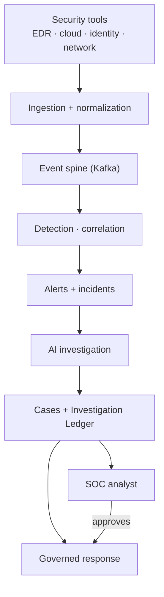
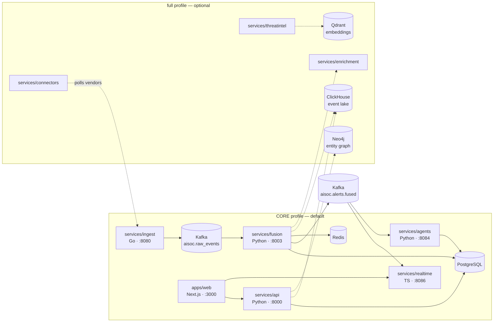
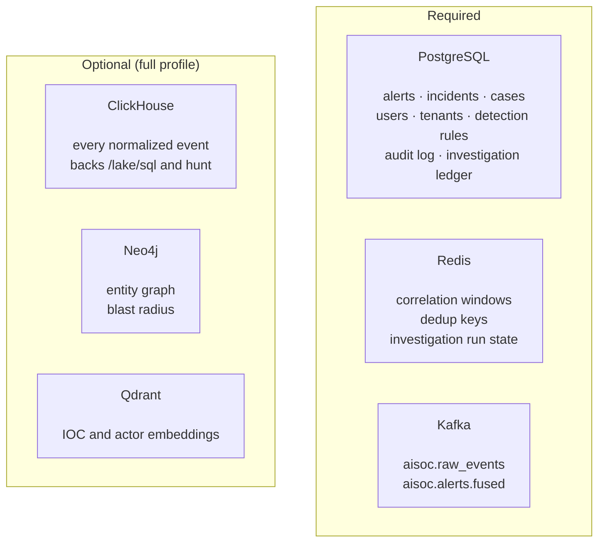
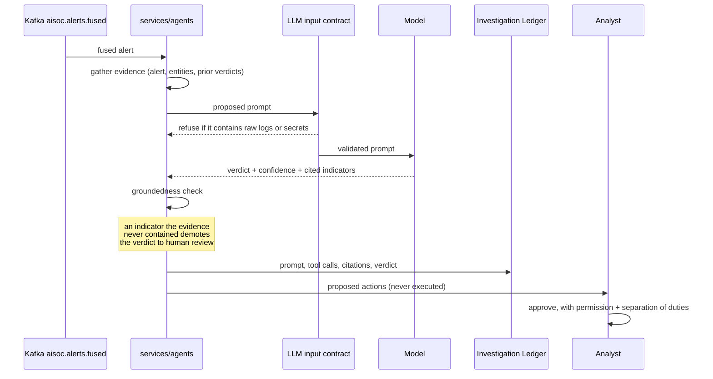
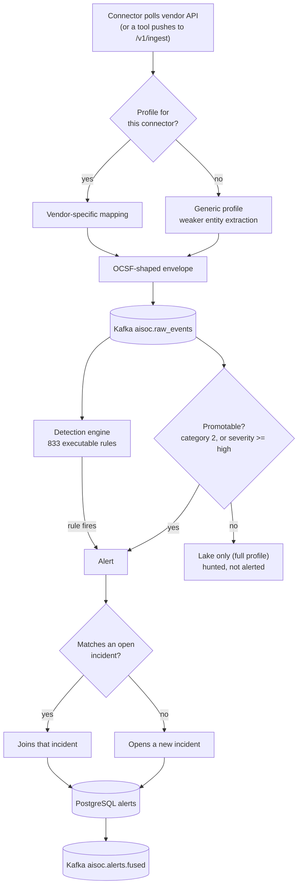

# Architecture

Every box in every diagram below corresponds to code in this repository, and
links to it. Where a component exists but is not used, it says so rather than
being quietly drawn in.

---

## What happens when AiSOC receives one security event

Follow a single event. This is the whole system, in order.

**1. Something sends telemetry.** Either a connector polls a vendor API on a
schedule, or a tool pushes to the ingest HTTP API directly:

```bash
curl -X POST http://localhost:8081/v1/ingest/batch \
  -H 'Content-Type: application/json' \
  -H 'X-Tenant-ID: <your-tenant>' \
  -d '{"connector_id":"edr-1","connector_type":"crowdstrike","source_format":"json",
       "events":[{"severity":"high","title":"Encoded PowerShell from Office",
                  "host":"WIN-FIN-01","process_name":"powershell.exe",
                  "parent_process":"winword.exe"}]}'
```

**2. Ingest normalizes it.** [`services/ingest`](../../services/ingest) maps
the vendor payload onto a common OCSF-shaped envelope using a per-connector
profile. A connector with no profile falls through to a vendor-neutral
generic profile — the event still flows, but entity extraction is weaker.

**3. It enters the event spine.** Ingest publishes to the Kafka topic
`aisoc.raw_events`. This is the boundary that makes everything downstream
independent: anything can consume the spine without ingest knowing about it.

**4. Fusion consumes it and evaluates detections.**
[`services/fusion`](../../services/fusion) runs the 833 executable rules
against the event. Separately it decides whether the event is *promotable* —
a vendor finding (OCSF category 2) or anything at severity ≥ high becomes an
alert; routine telemetry does not.

**5. Fusion correlates.** A new alert is matched against open incidents using
a correlation key of `{tenant}:{entity}:{tactic}`. It either joins an
existing incident or opens a new one, so ten related alerts become one thing
an analyst looks at.

**6. The alert is written to Postgres** and published to
`aisoc.alerts.fused`.

**7. Two consumers pick it up.**
[`services/realtime`](../../services/realtime) pushes it to the console over
WebSocket. [`services/agents`](../../services/agents) auto-triages it with an
LLM — a verdict, a confidence, and proposed actions.

**8. The agent's work is written to the Investigation Ledger** — every
prompt, tool call and citation, so a verdict can be audited rather than
trusted.

**9. Response stays governed.** Nothing executes automatically. An action is
proposed; a human with the right permission approves it; the result is
verified against the vendor rather than assumed from an HTTP 200.

> **Where it stops.** Step 9 has no automatic trigger — there is no code path
> that dispatches a response without a human. That is deliberate, and it is
> the honest boundary of "autonomous" in this project.

---

## Diagram 1 — the shape of it



---

## Diagram 2 — actual services

Only services that exist and run. Dashed boxes are the `full` profile.



---

## Diagram 3 — who owns which data



**Why each one, and what breaks without it:**

| Store | Why it is not replaceable by Postgres | Without it |
|---|---|---|
| **PostgreSQL** | — | Nothing works. |
| **Redis** | Correlation needs expiring keys at event rate; TTL semantics and throughput are the point. | No correlation; every alert becomes its own incident. |
| **Kafka** | Decouples producers from consumers and lets a slow consumer fall behind without dropping events or blocking ingest. | No spine; fusion, realtime and agents would each need a direct call from ingest. |
| **ClickHouse** | Columnar scans over hundreds of millions of events. Postgres cannot do this at cost. | No event lake, no hunting over raw telemetry. **Alerting is unaffected.** |
| **Neo4j** | Multi-hop traversal ("what else did this identity touch") is a join explosion in SQL. | No graph context or blast radius. Alerting unaffected. |
| **Qdrant** | Vector similarity for IOC and actor matching. | No semantic threat-intel matching. |

**OpenSearch is started by the `full` profile and nothing reads from it.**
It is recorded in [the reality audit](../audit/REPOSITORY_REALITY.md) as
unused rather than drawn here as though it were part of the design.

---

## Diagram 4 — AI investigation



Three properties worth naming, because each is enforced in code:

- **The contract runs before the request.** A prompt about to carry raw OCSF,
  vendor log lines or secret-shaped values is refused, not logged after the
  fact.
- **Citations are checked against the evidence.** A verdict citing an
  indicator that was never in the evidence is demoted rather than auto-closed.
- **Approval is authorized, not just recorded.** The approver must hold the
  action's permission tier and must not be the requester.

---

## Diagram 5 — connector to alert



---

## Deployment profiles

One architecture, three profiles of it — not three architectures.

| Profile | Command | Services | RAM | What you get |
|---|---|---|---|---|
| **core** | `make up` | 10 | ~6 GB | Ingest → detect → correlate → alert → triage → console. The full alerting pipeline. |
| **full** | `make up-full` | 30 | ~12 GB | Core plus event lake, entity graph, vector store, enrichment, connectors, LLM gateway. |
| **demo** | `make up && make demo` | 10 | ~6 GB | Core plus clearly-labelled synthetic data. |

CORE is not a toy. It is the smallest deployment that can take a real event
and produce a real alert, which is the thing the product is for.

**Two flags travel with the `full` profile.** The lake writer and the
graph writer target stores that exist only there, so in CORE they default off
rather than retrying against a host that is not running:

```bash
AISOC_LAKE_WRITER_ENABLED=true AISOC_GRAPH_ENABLED=true \
  docker compose --profile full up -d
```

`make up-full` sets both for you, and the integration workflow sets the same
pair — so the documented command and the tested command are the same command.

---

## Verifying any of this

```bash
make up && make smoke
```

`make smoke` posts one event to the ingest API and follows it through Kafka,
fusion, detection, promotion and Postgres, then reads it back from the public
API. It reaches past nothing. Each stage reports PASS or FAIL separately, so
a break names the boundary that broke.

Source: [`tests/e2e/golden_pipeline/`](../../tests/e2e/golden_pipeline/).
