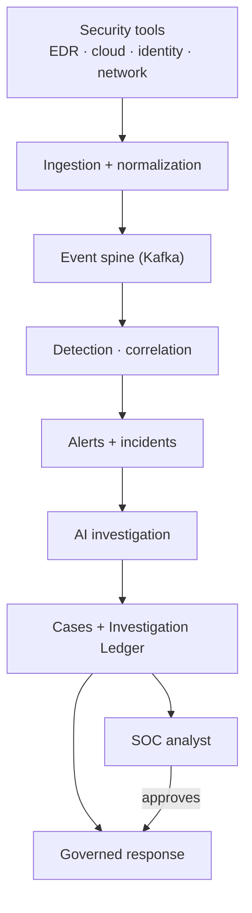
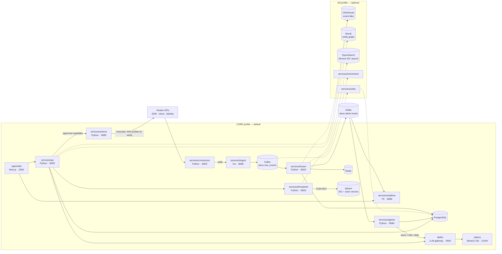
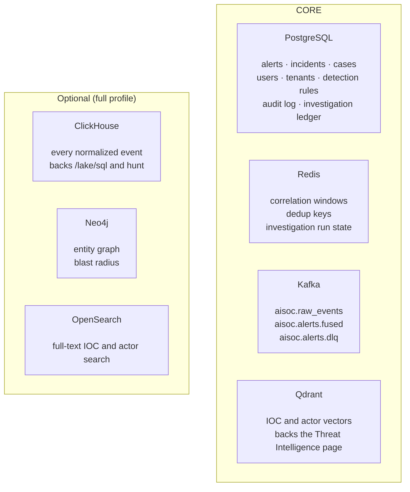
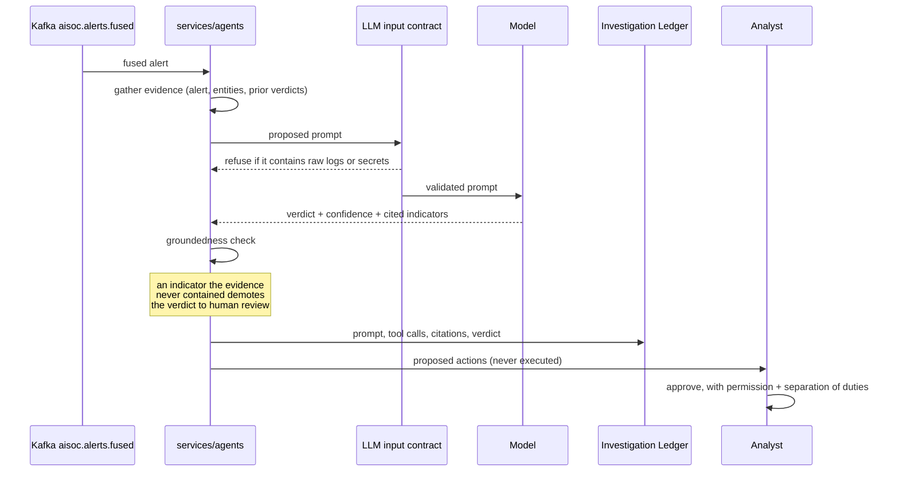
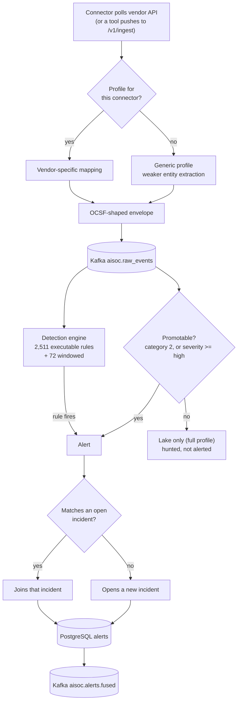

# Architecture

Every box in every diagram below corresponds to code in this repository, and
links to it. Where a component exists but is not used, it says so rather than
being quietly drawn in.

---

## What happens when AiSOC receives one security event

Follow a single event. This is the whole system, in order.

**1. Something sends telemetry.** Either a connector polls a vendor API on a
schedule, or a tool pushes to the ingest HTTP API directly, with a token from
`make ingest-token`:

```bash
curl -X POST http://localhost:8081/v1/ingest/batch \
  -H 'Content-Type: application/json' \
  -H "Authorization: Bearer $AISOC_INGEST_TOKEN" \
  -d '{"connector_id":"edr-1","connector_type":"crowdstrike","source_format":"json",
       "events":[{"severity":"high","title":"Encoded PowerShell from Office",
                  "host":"WIN-FIN-01","process_name":"powershell.exe",
                  "parent_process":"winword.exe"}]}'
```

**The tenant comes from the credential, never from a header.** `X-Tenant-ID` is
read but is never authority: it is *intersected* with what the credential
authorises, so naming a tenant outside that scope narrows to nothing and is
refused rather than reaching out. There is no dev-mode bypass, and an ingest
service that cannot verify a credential answers 503 rather than accepting the
write.

**Polling is not always a REST call.** A cloud estate publishes to a queue or an
object store rather than answering a list API, so four collectors read those
surfaces directly: a CloudTrail organisation trail on **S3 notified over SQS**
(management events, data events and VPC flow logs — none of which
`cloudtrail:LookupEvents` returns), a **GCP Pub/Sub** subscription on a Cloud
Logging sink, an **Azure Event Hubs** capture, and a **syslog/CEF** listener.
Each declares a resumable cursor, so a restart neither re-reads from "now" and
loses the gap nor replays the whole bucket, and a bounded per-poll budget, so a
week-deep backlog applies backpressure instead of becoming an out-of-memory
kill or a flood through ingest.

**2. Ingest normalizes it.** [`services/ingest`](../../services/ingest) maps
the vendor payload onto a common OCSF-shaped envelope using a per-connector
profile. A connector with no profile falls through to a vendor-neutral generic
profile, which resolves `actor.user.name`, `device.name` and `src_endpoint.ip`
from the spellings connectors actually use (`user` / `username` / `actor`,
`host` / `hostname`, `src_ip` / `source_ip` / `client_ip`) in a fixed order.
The event keeps the entities the rest of the platform pivots on; what a vendor
profile adds is that vendor's own field names and its OCSF class.

`connector_type` is matched against the profile keys, and the identifiers the
connectors service declares are the ones to use — `crowdstrike`, not
`crowdstrike_falcon`. Both resolve, and
[`scripts/check_connector_profiles.py`](../../scripts/check_connector_profiles.py)
fails CI if any name in either direction stops resolving.

The profile also decides the **OCSF class**. There are 17 of them in
[`ocsf_classes.go`](../../services/ingest/internal/normalizer/ocsf_classes.go),
verified against the published OCSF schema; of the 87 declared connector types,
45 name a class of their own and the other 42 sit on the generic `2001` mapping
**with a recorded reason each**. That decision is load-bearing rather than
cosmetic: promotion reads the class, so a connector silently left on a category-4
default archives its events and never raises an alert.

**Every event carries an activity projection.** Alongside the vendor's own
fields, ingest writes a fixed five-part answer to "what happened" — actor,
action, resource, location, outcome — in
[`internal/activity`](../../services/ingest/internal/activity). `actor.kind` is
one of seven values (`human`, `service_account`, `workload`, `api_token`,
`oauth_app`, `ai_agent`, `unknown`) and is **derived from a documented vendor
field in each of 27 cases, never guessed from the shape of a username**: a
service account that looks like a person, or a CI token that looks like a
service account, is the misreading that makes an identity rule either noisy or
blind. The same eighteen projection columns exist in the ClickHouse table, the
lake migration and the fusion writer, and
[`scripts/check_activity_projection.py`](../../scripts/check_activity_projection.py)
holds all five of the Go definition, the lake table, the lake migration, the
fusion writer and the graph schema in agreement — a projection that five
components spell differently is five projections.

**And a classification for the event type.** `schemas/event_catalog/` declares
44 event types across 10 sources (CloudTrail, Entra, Azure Activity, GCP Cloud
Audit, Kubernetes audit, Okta, GitHub, Google Workspace, M365 and Slack audit),
each with a sensitivity on the same five-tier ladder. Ingest reads it at boot
from a vendored copy that is byte-compared against the source, so the catalogue
cannot drift from what the Go binary actually loads.

**3. It enters the event spine.** Ingest publishes to the Kafka topic
`aisoc.raw_events`. This is the boundary that makes everything downstream
independent: anything can consume the spine without ingest knowing about it.

**4. Fusion consumes it and evaluates detections.**
[`services/fusion`](../../services/fusion) runs the 2,511 executable rules
against the event — 741 native and 1,770 imported Sigma rules, each of which
was replayed through its real connector and this engine and watched to fire
before it was allowed into the compiled ruleset. Separately it decides whether the event is *promotable* —
a vendor finding (OCSF category 2) or anything at severity ≥ high becomes an
alert; routine telemetry does not.

That figure went **down** from 2,603, and the direction is the point. Rules that
named a counter no source emits were being loaded, counted as executable and
could never fire; they were either rewritten as windowed rules or refused with a
reason, rather than left in the total. Rules that still cannot fire are counted
by [`scripts/check_detection_fields.py`](../../scripts/check_detection_fields.py)
against a ratchet that only moves down, and it now stands at **2** — both waiting
on a behavioural baseline.

**Some detections need more than one event.** A separate windowed engine
([`windowed_detection.py`](../../services/fusion/app/services/windowed_detection.py))
holds 72 compiled rules plus three built-ins. Seventy count events or distinct
values for one entity over a sliding window and fire on a threshold; the other
two are **sequences** — A then B by the same entity, either ordered in time or
not, with stages disjoint so a drip cannot walk a sequence forward forever.
Four of the 72 are compiled from Sigma **correlation** documents
(`event_count`, `value_count`, `temporal`, `temporal_ordered`) by
[`scripts/sigma_correlation.py`](../../scripts/sigma_correlation.py), which
refuses what it cannot carry and records why — a correlation grouping by two
fields when the engine accumulates against one entity is refused rather than
approximated. The windowed count is published separately from the executable
figure on purpose: a threshold over a window and a single-event match are not
the same kind of thing, and adding them would make two incomparable numbers
into one.

Each match is then checked against that tenant's **tuning overlay**
([`tenant_overlay.py`](../../services/fusion/app/services/tenant_overlay.py)):
the disables, severity floors and suppressions the console writes to
`detection_rules`. Before this existed the engine evaluated the shared corpus
and nothing else, so a tenant who turned a noisy rule off kept receiving its
alerts while the console showed it disabled — the worst shape a defect can
have, because it tells the operator the problem is solved.

It is an overlay rather than a per-tenant ruleset: the *difference* applied
over one shared corpus, not N copies of 2,511 rules rebuilt whenever anyone
edits anything. Suppression is applied **after** the match so the dropped hit
is logged with the tuning, its author and its reason — "no alert" with no
explanation is indistinguishable from a rule that simply did not match. A
reload that fails keeps the previous overlay rather than falling back to
no-tuning, since losing a tenant's suppressions on a transient database error
would turn their queue back on and read as a flood rather than a fault.

**5. Fusion correlates.** A new alert is matched against open incidents using
a correlation key of `{tenant}:{entity}:{tactic}`. It either joins an
existing incident or opens a new one, so ten related alerts become one thing
an analyst looks at.

**6. The alert is written to Postgres** and published to
`aisoc.alerts.fused`.

**7. Two consumers pick it up.**
[`services/realtime`](../../services/realtime) pushes it to the console over
WebSocket. [`services/agents`](../../services/agents) auto-triages it with an
LLM — a verdict, a confidence, and proposed actions.

**8. The agent's work is written to the Investigation Ledger** — every
prompt, tool call and citation, so a verdict can be audited rather than
trusted.

**9. A playbook may start from the alert.** The fused-alert path matches it
against the playbook library
([`alert_trigger.py`](../../services/agents/app/playbook/alert_trigger.py)),
*after* triage, because a playbook's conditions read the verdict and the
confidence. Three switches must all agree before one acts — the deployment,
the tenant, and the playbook — and **every default is off**. Anything short of
all three runs in **preview**, with its plan and simulated steps attached to
the alert so an analyst can read what it would have done. Preview is the
default state rather than a mode somebody has to remember to use first.

**10. An approval step is a durable pause.** A playbook that reaches one
suspends to Postgres (migration `081`) rather than failing: the step index and
the whole run context, so the run survives a restart and resumes from the step
*after* the approval when a human decides. Undecided approvals expire with a
recorded outcome, because `expired` is a decision and a pause with no deadline
is a run that hangs forever while nobody learns it did.

**11. Response stays governed.** An action is proposed; a human with the right
permission approves it; the result is verified against the vendor rather than
assumed from an HTTP 200.

A playbook's step vocabulary is **25 types**, and all 25 are runnable — the
schema, the engine, the shared TypeScript types and the console editor are held
in agreement in both directions by
[`scripts/check_playbook_schema_parity.py`](../../scripts/check_playbook_schema_parity.py),
because an editor that offers a step the engine cannot run and an engine with a
step the editor hides are the same defect seen from two sides. Beyond the linear
walk there are `wait` (a timer or a callback), `parallel` (fan out, then join)
and `loop` (once per item, bounded) — each carrying an **idempotency key**, so a
resumed or retried run does not repeat a step that already took effect. Of the
25, nine execute directly and **16 are governed verbs** graded against a
capability contract at dispatch, `notify` and `osquery_live_query` among them:
sending a message to a channel and running a live query across a fleet are both
things an operator should be able to withhold.

Delivery outward is real rather than described: signed outbound webhooks, SMTP
mail, email approvals, and a report scheduler.

> **Where it stops, stated precisely.** A *playbook* can now be triggered
> automatically — that changed, and the three switches above are what bound
> it. What did not change is the thing that matters: every response step is
> still graded against its own capability contract at dispatch and returns
> `pending_approval` on its own when a human is required. So approving a
> playbook never authorises whatever its steps happen to contain, and there
> is still no code path that touches a vendor without either a human or an
> explicit per-tenant autonomy policy. That is the honest boundary of
> "autonomous" in this project.

---

## Diagram 1 — the shape of it


```mermaid
flowchart TD
    sources["Security tools<br/>EDR · cloud · identity · network"]
    ingest["Ingestion + normalization"]
    spine["Event spine (Kafka)"]
    detect["Detection · correlation"]
    alerts["Alerts + incidents"]
    ai["AI investigation"]
    cases["Cases + Investigation Ledger"]
    respond["Governed response"]
    analyst["SOC analyst"]

    sources --> ingest --> spine --> detect --> alerts --> ai --> cases --> respond
    cases --> analyst
    analyst -->|approves| respond
```

---

## Diagram 2 — actual services

Only services that exist and run. Dashed boxes are the `full` profile.


```mermaid
flowchart LR
    subgraph core ["CORE profile — default"]
        ing["services/ingest<br/>Go · :8080"]
        kaf[("Kafka<br/>aisoc.raw_events")]
        fus["services/fusion<br/>Python · :8003"]
        pg[("PostgreSQL")]
        rds[("Redis")]
        api["services/api<br/>Python · :8000"]
        rt["services/realtime<br/>TS · :8086"]
        agt["services/agents<br/>Python · :8084"]
        web["apps/web<br/>Next.js · :3000"]
        llm["litellm<br/>LLM gateway · :4000"]
        oll["ollama<br/>llama3.2:3b · :11434"]
        ti["services/threatintel<br/>Python · :8005"]
        qd[("Qdrant<br/>IOC + actor vectors")]
        conn["services/connectors<br/>Python · :8003"]
        act["services/actions<br/>Python · :8085"]
    end

    subgraph full ["full profile — optional"]
        ch[("ClickHouse<br/>event lake")]
        neo[("Neo4j<br/>entity graph")]
        os[("OpenSearch<br/>full-text IOC search")]
        enr["services/enrichment"]
        ueba["services/ueba"]
    end

    vend["Vendor APIs<br/>EDR · cloud · identity"]
    conn -->|"polls"| ing
    vend --> conn
    api -->|"approved capability"| act
    act -->|"executes, then probes to verify"| vend
    ing --> kaf
    kaf --> fus
    fus --> pg
    fus --> kafd[("Kafka<br/>aisoc.alerts.fused")]
    fus --> rds
    fus -.-> ch
    fus -.-> enr
    kaf -.-> ueba
    ueba -.-> pg
    kafd --> rt
    kafd --> agt
    agt --> pg
    agt -->|"aisoc-&lt;role&gt; alias"| llm
    api --> llm
    llm --> oll
    api --> pg
    api -.-> ch
    api -.-> neo
    ti -->|"CISA KEV"| qd
    ti -.-> os
    api --> ti
    web --> api
    web --> rt
```

---

## Diagram 3 — who owns which data


```mermaid
flowchart TB
    subgraph req ["CORE"]
        pg["PostgreSQL<br/><br/>alerts · incidents · cases<br/>users · tenants · detection rules<br/>audit log · investigation ledger"]
        rds["Redis<br/><br/>correlation windows<br/>dedup keys<br/>investigation run state"]
        kaf["Kafka<br/><br/>aisoc.raw_events<br/>aisoc.alerts.fused<br/>aisoc.alerts.dlq"]
        qd["Qdrant<br/><br/>IOC and actor vectors<br/>backs the Threat Intelligence page"]
    end

    subgraph opt ["Optional (full profile)"]
        ch["ClickHouse<br/><br/>every normalized event<br/>backs /lake/sql and hunt"]
        neo["Neo4j<br/><br/>entity graph<br/>blast radius"]
        os["OpenSearch<br/><br/>full-text IOC and actor search"]
    end
```

**Why each one, and what breaks without it:**

| Store | Why it is not replaceable by Postgres | Without it |
|---|---|---|
| **PostgreSQL** | — | Nothing works. |
| **Redis** | Correlation needs expiring keys at event rate; TTL semantics and throughput are the point. | No correlation; every alert becomes its own incident. |
| **Kafka** | Decouples producers from consumers and lets a slow consumer fall behind without dropping events or blocking ingest. | No spine; fusion, realtime and agents would each need a direct call from ingest. |
| **ClickHouse** | Columnar scans over hundreds of millions of events. Postgres cannot do this at cost. | No event lake, no hunting over raw telemetry. **Alerting is unaffected.** |
| **Neo4j** | Multi-hop traversal ("what else did this identity touch") is a join explosion in SQL. | No graph context or blast radius. `/graph` reports the failure rather than drawing an invented graph. Alerting unaffected. |
| **Qdrant** | Vector similarity for IOC and actor matching, and the read path the console's Threat Intelligence page is served from. | No threat-intel page. It is in CORE for that reason, and because it is by a wide margin the cheapest of the four stores — 245 MB of image, ~79 MiB resident. |
| **OpenSearch** | Full-text and structured search over the threat-intel corpus — `threatintel-iocs` and `threatintel-actors`. | Feeds still write to Qdrant and the page still works; full-text IOC search is unavailable and `services/threatintel` logs that it is. |

### How long any of it is kept

Retention is per tenant, and the lake is the part that needs a ceiling rather
than a preference: a tenant choosing to keep raw events forever is choosing an
unbounded ClickHouse bill, so the TTL a tenant picks is clamped to a maximum
the deployment sets. The purge worker
([`retention.py`](../../services/api/app/services/retention.py)) binds its
tenant predicate **explicitly** rather than leaning on row-level security,
because it runs on a session with row security off and would otherwise purge
every tenant under the first tenant's window. A dry run reports the blast
radius using the same predicate as the delete, so the preview cannot disagree
with the thing it previews.

**Legal holds are read, not merely stored.** Alerts under a hold
(`alerts_under_legal_hold`, migration `088`) survive a purge that would
otherwise have reached them — a retention policy that silently deleted
evidence under hold would be worse than having no policy, because nobody would
know. One window is deliberately *not* purged: `audit_days` is storable but the
audit log is an append-only hash chain, and truncating it invalidates every
later verification, so it needs chain-aware truncation with a re-anchored
checkpoint before it can be honoured.

**Who reads OpenSearch, precisely:** only `services/threatintel`. This page
previously said nothing read it at all, which came from checking
`services/api` — which genuinely holds no OpenSearch client — and stopping
there. It also said `services/threatintel` *could not start* without it; that
was true when the lifespan called `os_store.initialize()` with no `try`, and
is no longer — both that call and the pipeline's bulk index are best-effort,
which is what let the service move into CORE. See the corrections in
[the reality audit](../audit/REPOSITORY_REALITY.md).

---

## Diagram 4 — AI investigation


```mermaid
sequenceDiagram
    participant K as Kafka aisoc.alerts.fused
    participant A as services/agents
    participant C as LLM input contract
    participant M as Model
    participant L as Investigation Ledger
    participant H as Analyst

    K->>A: fused alert
    A->>A: gather evidence (alert, entities, prior verdicts)
    A->>C: proposed prompt
    C-->>A: refuse if it contains raw logs or secrets
    C->>M: validated prompt
    M-->>A: verdict + confidence + cited indicators
    A->>A: groundedness check
    Note over A: an indicator the evidence<br/>never contained demotes<br/>the verdict to human review
    A->>L: prompt, tool calls, citations, verdict
    A->>H: proposed actions (never executed)
    H->>H: approve, with permission + separation of duties
```

Three properties worth naming, because each is enforced in code:

- **The contract runs before the request.** A prompt about to carry raw OCSF,
  vendor log lines or secret-shaped values is refused, not logged after the
  fact.
- **Citations are checked against the evidence.** A verdict citing an
  indicator that was never in the evidence is demoted rather than auto-closed.
- **Approval is authorized, not just recorded.** The approver must hold the
  action's permission tier and must not be the requester.

### Who that approver is, and what they are allowed to be

Console sign-in is SAML, OIDC or local, with a second factor: TOTP plus
single-use recovery codes, enforceable per tenant rather than per user, so an
administrator can require it of everyone instead of hoping.

Permissions resolve through **one** path, which is what makes the rest
checkable — [`check_one_permission_model.py`](../../scripts/check_one_permission_model.py)
requires the call to sit at a function's own level rather than inside a branch,
because a permission check behind an `if` is a permission check somebody can
route around. Three things hang off that single path:

* **Attribute conditions (ABAC).** A tenant can narrow a permission it has
  already granted — `cases:write` only from a named CIDR, say. A condition can
  only ever turn an allow into a deny; it cannot grant something the role does
  not hold, and a condition that cannot be evaluated denies rather than
  passing. A client-supplied `X-Forwarded-For` cannot move a caller into a
  permitted range.
* **Time-boxed elevation.** A grant confers its permissions until it expires
  and not one request longer.
* **Workload identities.** A non-human caller is a first-class principal with
  its own scopes, rather than a human account with a shared password.

All three have readers on the live path and a live-Postgres job behind them
([`access-governance-live.yml`](../../.github/workflows/access-governance-live.yml),
[`mfa-live.yml`](../../.github/workflows/mfa-live.yml)) that carries a negative
control — it deletes the check and requires the suite to go red. One operator is
deliberately refused at write time: a condition on `mfa_satisfied`, because the
principal does not yet carry that fact and a stored condition naming it could
only ever be indeterminate, which denies. Refusing it is better than storing a
condition that quietly locks a tenant out.

---

## Diagram 5 — connector to alert


```mermaid
flowchart TD
    A["Connector polls vendor API<br/>(or a tool pushes to /v1/ingest)"] --> B{"Profile for<br/>this connector?"}
    B -->|yes| C["Vendor-specific mapping"]
    B -->|no| D["Generic profile<br/>weaker entity extraction"]
    C --> E["OCSF-shaped envelope"]
    D --> E
    E --> F[("Kafka aisoc.raw_events")]
    F --> G["Detection engine<br/>2,511 executable rules<br/>+ 72 windowed"]
    F --> H{"Promotable?<br/>category 2, or severity >= high"}
    G -->|rule fires| I["Alert"]
    H -->|yes| I
    H -->|no| J["Lake only (full profile)<br/>hunted, not alerted"]
    I --> K{"Matches an open<br/>incident?"}
    K -->|yes| L["Joins that incident"]
    K -->|no| M["Opens a new incident"]
    L --> N[("PostgreSQL alerts")]
    M --> N
    N --> O[("Kafka aisoc.alerts.fused")]
```

---

## Deployment profiles

One architecture, three profiles of it — not three architectures.

| Profile | Command | Services | RAM | What you get |
|---|---|---|---|---|
| **core** | `make up` | 16 | ~8 GB | Ingest → detect → correlate → alert → triage → console, plus the LLM gateway, the local model behind it, the CISA KEV threat feed with its vector store, and the connector and response services the agent's vendor tools reach. |
| **full** | `make up-full` | 22 | ~12 GB | Core plus event lake, entity graph, full-text search, enrichment, scheduled connectors. |
| **demo** | `make up && make demo` | 16 | ~8 GB | Core plus clearly-labelled synthetic data. |

`full` is 22 services, not the 30 published here previously: 30 is `full` plus
the `monitoring`, `chatops`, `extras` and `osquery` profiles, which
`make up-full` does not start. The CORE count is **16 long-running
containers**; `ollama-pull` is a seventeenth that runs once and exits, and is
excluded because "long-running services" is the figure these documents
publish.

This page said 14 for as long as `connectors` and `actions` had been in CORE,
because it was the one place publishing a service count that
[`scripts/check_profile_service_counts.py`](../../scripts/check_profile_service_counts.py)
did not know about. It is registered now, so the next change to the compose
file fails the build here too rather than only in the eight places that were
already covered.

CORE is not a toy. It is the smallest deployment that can take a real event
and produce a real alert, which is the thing the product is for — **and it does
that, and triages the result with a real model, with no credentials**. Three
services moved into CORE to make that last clause true:

* **`litellm`** — the gateway. Every `aisoc-<role>` alias resolves here and
  nowhere else, so a CORE deployment *with* a provider key could not use it.
* **`ollama` (+ a one-shot `ollama-pull`)** — the model behind the gateway,
  pinned at `llama3.2:3b-instruct-q4_K_M` (~2 GB, CPU-only). Promoted from the
  air-gapped overlay, where this pairing was already proven end to end. Without
  it the gateway in CORE could route a key nobody had.
* **`threatintel` + `qdrant`** — the CISA Known Exploited Vulnerabilities feed,
  which is public and keyless, and the store it writes to. OpenSearch and Neo4j
  stay in `full`: both sinks are best-effort, so their absence costs full-text
  IOC search and the actor graph, not the feed.

**Two flags travel with the `full` profile.** The lake writer and the
graph writer target stores that exist only there, so in CORE they default off
rather than retrying against a host that is not running:

```bash
AISOC_LAKE_WRITER_ENABLED=true AISOC_GRAPH_ENABLED=true \
  docker compose --profile full up -d
```

`make up-full` sets both for you, and the integration workflow sets the same
pair — so the documented command and the tested command are the same command.

---

## What a first run does differently

Nothing above changes on a fresh install — that is the point of this section.
The paths a new deployment takes are the same paths, arranged so an operator
can reach them.

**The host decides the ports, not the compose file.** `make up` probes the
sixteen host ports CORE publishes and moves any that are taken, writing
`docker-compose.ports.yml` with `ports: !override` and naming what held each
one. Only the published side moves: service-to-service traffic uses container
ports and service names, so nothing in any diagram above is affected. If the
console itself moves, `AISOC_CONSOLE_URL` moves with it so the address printed
at the end is the one that answers.

This replaced a refusal. `make up` used to stop and tell the operator to edit
`docker-compose.yml`, which is a hard stop at step one of the quick start for
the most common condition in this audience's environment — a Postgres on 5432,
or an Ollama on 11434.

**The console asks the database what is set up, not a flag.**
`GET /api/v1/onboarding/status` derives first-run state from the tenant's own
rows. A stored `onboarded` boolean drifts the moment somebody connects a source
through the API, deletes their last one, or restores a backup, and a wizard
insisting you are finished while your estate is empty is worse than no wizard.
A tenant with no connectors and no alerts lands on the setup checklist rather
than on an all-zero dashboard.

**Sample data takes the real path.** `POST /api/v1/onboarding/sample-data`
pushes five scenarios through `POST /v1/ingest/batch` — step 1 above, the same
door a connector uses — so they are normalised, correlated and triaged exactly
like real telemetry. Inserting rows would have been easier and would have
proved nothing: a console full of seeded alerts looks identical whether the
pipeline works or is completely broken. Because these take the real path,
seeing them arrive means the operator has watched steps 1 through 8 work.

Three constraints keep that honest, and each is asserted by test rather than
left to care:

* **It does not clear `first_run`.** Somebody who has only looked at samples
  still has nothing connected.
* **It refuses on a tenant that already has real alerts.** A sample sitting in
  a live queue is indistinguishable from a real one at a glance, and an analyst
  dismissing a genuine alert because they assumed otherwise is the worse
  outcome.
* **It is obviously synthetic.** Every address is an RFC 5737 documentation
  range and every domain RFC 2606 reserved, and `aisoc_sample` has its own
  ingest profile naming AiSOC as the vendor — so the alert's own source column
  says where it came from, without anyone needing to remember context.

That profile exists for the same reason every other one does. Without it the
batch would fall to the generic profile, every event would get the same title
and no vendor id, and all five would deduplicate onto one alert.

## Verifying any of this

```bash
make up && make smoke
```

`make smoke` posts one event to the ingest API and follows it through Kafka,
fusion, detection, promotion and Postgres, then reads it back from the public
API. It reaches past nothing. Each stage reports PASS or FAIL separately, so
a break names the boundary that broke.

Source: [`tests/e2e/golden_pipeline/`](../../tests/e2e/golden_pipeline/).

### What CI proves about each piece above

`make smoke` is the whole pipeline. Each capability in it also has a check
that runs on **every pull request with no path filter**, drives the real
production path against real infrastructure, and carries a negative control
— something that breaks the thing and is required to turn the check red.
The bar, and why it is that bar, is in
[`docs/audit/MATURITY_DEFINITION.md`](../audit/MATURITY_DEFINITION.md).

| What it proves | Workflow | What breaking it looks like |
|---|---|---|
| Graph reads are tenant-scoped in `graph_service.py` | `graph-live.yml` | Remove the anchor's tenant predicate → 1 test fails |
| UEBA scores and persists against the shipped migrations | `ueba-live.yml` | Drop `peer_group_id` → 4 of 5 fail |
| An approval pause survives a restart and resolves once | `playbook-pause-live.yml` | Drop the partial unique index → the constraint test fails |
| The Investigation Ledger persists, scopes and refuses | `playbook-pause-live.yml` | — |
| Tenant tuning changes what the engine fires | `tenant-tuning-live.yml` | Re-add the two columns the table lacks → 6 of 10 fail |
| SCIM provisions and isolates through the real app | `scim-live.yml` | Remove the tenant predicate → the isolation test fails |
| A connector polls a vendor and reaches ingest | `connector-scheduler-live.yml` | `next_run_time=None` → 4 of 5 fail |
| Governance permits, refuses, and leaks no refusal | `live-actions-live.yml` | Remove all three branches → the refused isolate reaches the vendor |
| The shipped ClickHouse DDL loads; `POST /lake/sql` scopes | `lake-live.yml` | Make the rewrite a pass-through → 6 of 7 fail |
| Scheduled hunts read tenant data, never the fixture | `lake-live.yml` | — |
| Intel travels feed → Kafka → sweep → alert | `retro-hunt-live.yml` | Remove the per-tenant savepoint → 5 of 8 fail |
| The agent places a real LLM call on this commit | `live-agent-eval.yml` | `llm_calls_placed: 0` fails the job |

Two of those rows exist because the suite behind them found a defect no
offline test could: the connector scheduler registered every poll job
**paused**, so connecting a source never pulled data; and the retro-hunt
fan-out flushed one tenant's rows under the *next* tenant's RLS context,
so it persisted nothing on any deployment using the runtime role.
